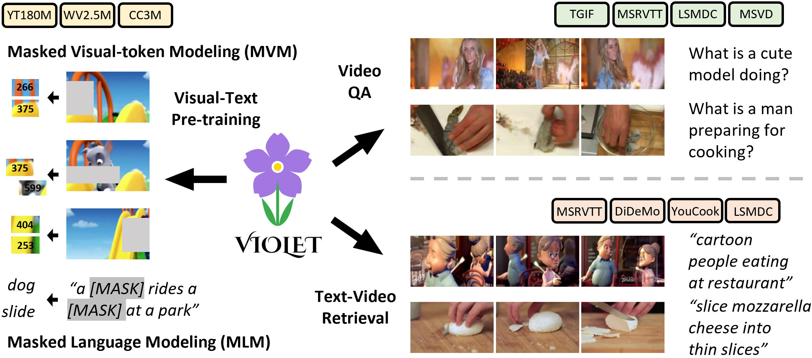
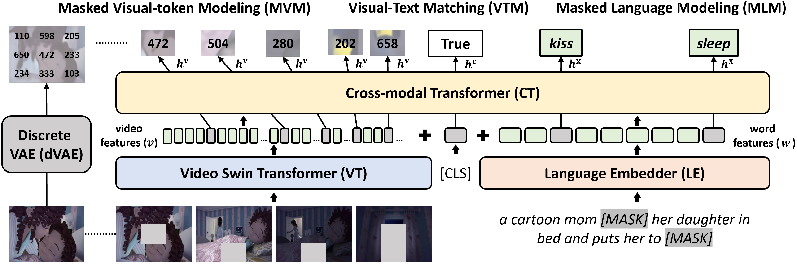

# VIOLET: End-to-End Video-Language Transformers with Masked Visual-token Modeling
A **PyTorch** implementation of [VIOLET](https://arxiv.org/pdf/2111.12681.pdf)



## Overview
VIOLET is an implementation of <br>
"[VIOLET: End-to-End Video-Language Transformers with Masked Visual-token Modeling](https://arxiv.org/pdf/2111.12681.pdf)" <br>
[Tsu-Jui Fu](https://tsujuifu.github.io), [Linjie Li](https://scholar.google.com/citations?user=WR875gYAAAAJ), [Zhe Gan](https://zhegan27.github.io), [Kevin Lin](https://sites.google.com/site/kevinlin311tw/me), [William Yang Wang](https://sites.cs.ucsb.edu/~william), [Lijuan Wang](https://scholar.google.com/citations?user=cDcWXuIAAAAJ), and [Zicheng Liu](https://scholar.google.com/citations?user=bkALdvsAAAAJ)



VIOLET contains 3 components: **Video Swin Transformer (VT)** computes video features; **Language Embedder (LE)** extracts word embeddings; **Cross-modal Transformer (CT)** performs cross-modal fusion. To benefit from large-scale data, we incorporate 3 pretraining tasks: **Masked Language Modeling (MVM)** predicts the masked word tokens; **Masked Visual-token Modeling (MVM)** recovers the masked video patches; **Visual-Text Matching (VTM)** learns the alignments between video and text modality.

## Requirements
This code is implemented under **Python 3.8**, [PyTorch 1.7](https://pypi.org/project/torch/1.7.0), and [Torchvision 0.8](https://pypi.org/project/torchvision/0.8.0). <br>
+ [av](https://pypi.org/project/av), [tqdm](https://pypi.org/project/tqdm), [cv2](https://pypi.org/project/opencv-python)
+ [DALL-E](https://github.com/openai/DALL-E)
+ [transformers](https://pypi.org/project/transformers)

## Usage
### Data preprocessing
As using outer datasets (cannot be shared by us), we provide [preprocessing tools](https://github.com/tsujuifu/pytorch_violet/tree/main/_tools) to extract **sparse-sampled video frames** into our compressed format.
```
cd _tools

# We use 4 frames during pretraining and 5 frames for downstream tasks
python extract_video-frame.py --path=msrvtt --sample=5 # output: msrvtt.pkl

# We use DALL-E to extract VQ tokens for MVM pretraining
wget https://cdn.openai.com/dall-e/encoder.pkl # download trained dall-e encoder
python extract_vq.py --path=msrvtt --frame=224 # output: msrvtt_vq.pkl

# We adopt file.seek() instead of loading entire data to reduce the memory cost during distributed pretraining
python extract_tsv.py --path=msrvtt # output: msrvtt.tsv, msrvtt.lineidx
```
There are [parital examples](https://github.com/tsujuifu/pytorch_violet/tree/main/_data) (WebVid2.5M, CC3M, TGIF-Action, MSVD-QA, and MSRVTT-Retrieval) to help formulate the input data.

### Pretraining
Put [pretrained VT](https://drive.google.com/file/d/1B1tkA9EnlQlK72xB8liz_WRo7WTEpJDt/view?usp=sharing) in [./\_snapshot](https://github.com/tsujuifu/pytorch_violet/tree/main/_snapshot). This script pretrains on both video ([WebVid2.5M](https://m-bain.github.io/webvid-dataset)) and image ([CC3M](https://github.com/google-research-datasets/conceptual-captions)) data via **single-node multi-gpu** distributed training.
```
CUDA_VISIBLE_DEVICES='0,1,2,3' python -m torch.distributed.launch --nproc_per_node=4 --master_port=7122 main_pretrain.py
```
[Here](https://drive.google.com/file/d/1RLbthdRIflxCFjRTcVV5jQJGP30_lNfg/view?usp=sharing) is our best pretrained checkpoint ([YT180M](https://github.com/rowanz/merlot)+[WebVid2.5M](https://m-bain.github.io/webvid-dataset)+[CC3M](https://github.com/google-research-datasets/conceptual-captions)).

### Downstream
+ Multiple-Choice Question Answering ([TGIF-Action](https://github.com/YunseokJANG/tgif-qa), [TGIF-Transition](https://github.com/YunseokJANG/tgif-qa), [MSRVTT-MC](https://github.com/albanie/collaborative-experts/tree/master/misc/datasets/msrvtt), and [LSMDC-MC](https://github.com/yj-yu/lsmdc))
```
CUDA_VISIBLE_DEVICES='0,1,2,3' python main_qamc.py _data/args_tgif-action.json
```
+ Open-Ended Question Answering ([TGIF-Frame](https://github.com/YunseokJANG/tgif-qa), [MSRVTT-QA](https://github.com/xudejing/video-question-answering), [LSMDC-FiB](https://github.com/yj-yu/lsmdc), and [MSVD-QA](https://github.com/xudejing/video-question-answering))
```
CUDA_VISIBLE_DEVICES='0,1,2,3' python main_qaoe.py _data/args_msvd-qa.json
```
+ Text-to-Video Retrieval ([MSRVTT](https://github.com/albanie/collaborative-experts/tree/master/misc/datasets/msrvtt), [DiDeMo](https://github.com/LisaAnne/TemporalLanguageRelease), [YouCook2](http://youcook2.eecs.umich.edu), and [LSMDC](https://github.com/yj-yu/lsmdc))
```
CUDA_VISIBLE_DEVICES='0,1,2,3' python main_retrieval.py _data/args_msrvtt-retrieval.json
CUDA_VISIBLE_DEVICES='0,1,2,3' python eval_retrieval.py _data/args_msrvtt-retrieval.json
```
We also provide all [trained downstream checkpoints](https://drive.google.com/drive/u/1/folders/1cQ3O_9lxhjU_H6hpdyEb4GMjjb714wSo).

## Citation
```
@inproceedings{fu2021violet, 
  author = {Tsu-Jui Fu, Linjie Li, Zhe Gan, Kevin Lin, William Yang Wang, Lijuan Wang, and Zicheng Liu}, 
  title = {VIOLET: End-to-End Video-Language Transformers with Masked Visual-token Modeling}, 
  booktitle = {arXiv:2111.1268}, 
  year = {2021} 
}
```
